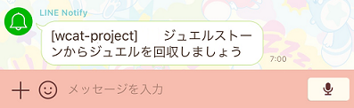

# LINE :two_hearts: 白猫プロジェクト

[LINE Notify](https://notify-bot.line.me) 経由で [白猫プロジェクト](http://colopl.co.jp/shironekoproject) に関する通知を配信します。

## 機能

- 毎日 7:00 と 19:00 にジュエルストーンの回収を通知

    

## 動作環境

- [Docker](https://www.docker.com)
- [Docker Compose](https://github.com/docker/compose)

## インストール

1. Git リポジトリからソースコードを取得します。

    ```sh
    git clone https://github.com/mugaming/line-wcat-project.git
    cd line-wcat-project
    ```

2. 必要な環境変数を設定します。

    ```sh
    # LINE Notify のパーソナル アクセス トークン
    echo 'LINE_TOKEN=......' >.env
    ```

3. 実行します。

    ```sh
    docker-compose up -d
    ```

## 使い方

- サーバーを所有しており上記インストール手順が実行できる方は、自分専用のサービスを実行できます。
- わからない方は、すでに動かしている方の LINE グループに招待してもらいましょう✋
